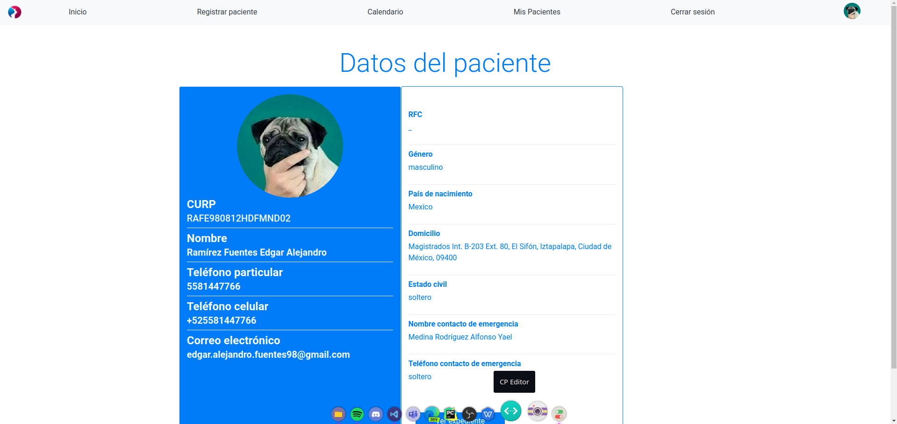

# CEDAE Medical Center Management System

## About <a name = "about"></a>

This is the final project of the Object-oriented analysis and design subject at ESCOM-IPN, which was inspired by the original CEDAE website and adds
new functionalities asked by the professor such as a management system of its Pharmacy, Employees, Clients, Appointments, and Sales.

[See documentation](https://github.com/EdgarRamirezFuentes/Sistema_CEDAE/blob/main/Entregables/entregable_9/entregable_9.pdf)
### Prerequisites

```
Python3
MySQL
pip3
Django
```

## Preview

### Home page

### Login page

### Doctor Home page

### Doctor's patients page

### Patient information page

### Patient's history page


## Contributors <a name = "contributors"></a>

[](https://github.com/EdgarRamirezFuentes) 
[](https://github.com/LuisAHC)
[](https://github.com/RayBaker221)
[](https://github.com/NadPat9) 